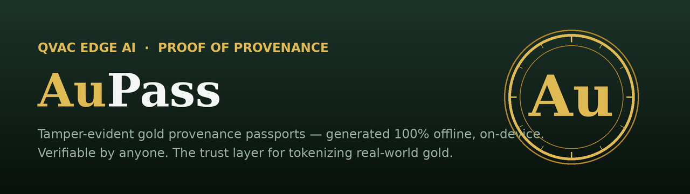
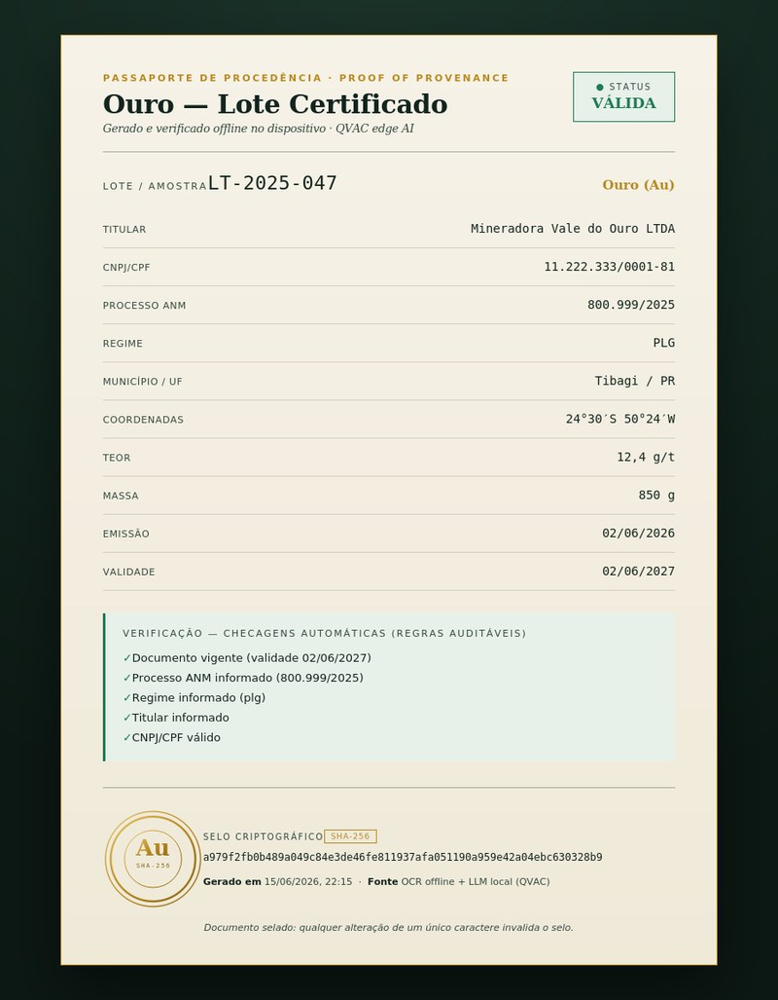
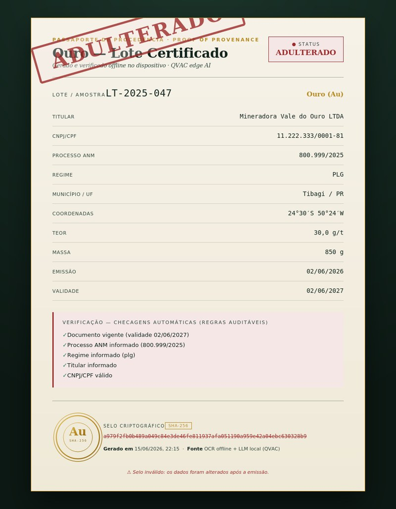
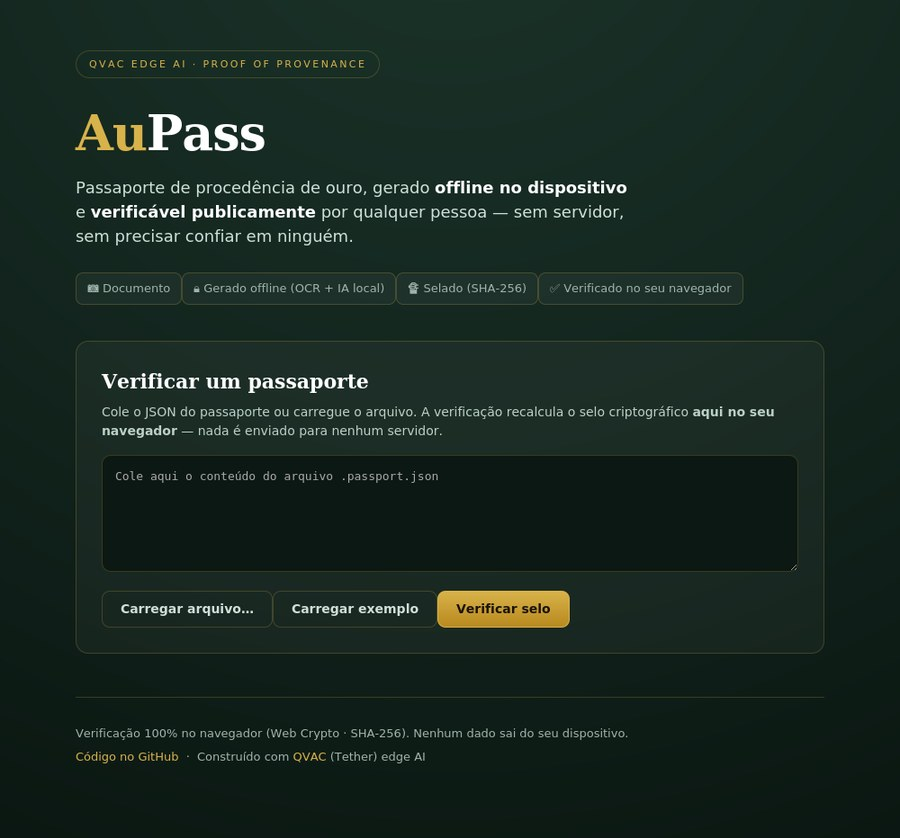
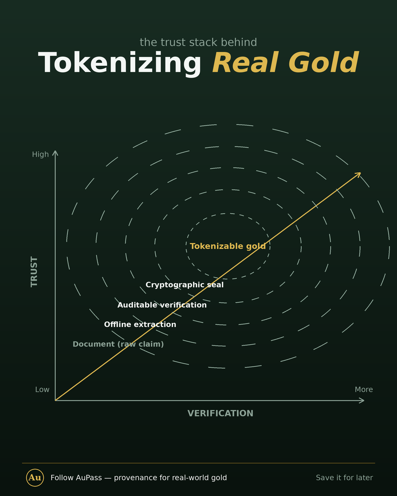

<p align="center">
  
</p>

<p align="center">
  
  
  
  
</p>

<p align="center">
  <b><a href="https://youtu.be/zM76XOV0gV0">▶️ Watch the demo</a></b>
  &nbsp;·&nbsp;
  <b><a href="https://web-felix-rodrigues-projects.vercel.app">🌐 Try the live verifier</a></b>
</p>

---

> **Offline, on-device edge AI that turns a mining document into a tamper-evident, publicly verifiable provenance passport for a gold lot — the trust layer that real-world-asset tokenization is missing.**

Built for the **QVAC Hackathon I – Unleash edge AI** (DoraHacks), on the [QVAC SDK](https://docs.qvac.tether.io) (Tether's edge-AI SDK).

## What it does

A photo **or digital PDF** of a mining document (ANM license / PLG permit, lab assay, packing list) becomes a structured, verified, cryptographically sealed provenance passport — **entirely on-device, no cloud**:

- 🔍 **Offline reading + local LLM** — images go through offline OCR; PDFs with a text layer are read directly (no OCR). The local LLM then structures the document (QVAC: ONNX OCR + Qwen3 4B) — fully offline.
- ✅ **Auditable verification** — explainable rules check validity dates, ANM process number, regime, owner, and **CNPJ check digits**. The AI *reads*; deterministic code *judges*.
- 🔏 **Tamper-evident SHA-256 seal** — change a single character of the data and the seal breaks. The seal also commits to the verification verdict, so a "valid" stamp can't be moved onto altered data.
- 🧾 **HTML certificate** — a clean **VALID** state and a red **ADULTERATED** state.
- 🌐 **Public verifier** — anyone re-checks a passport's seal in the browser, with no server and no trust required.
- 📈 **Structured audit log** — model load/unload + prompt, tokens, TTFT and tokens/sec, per run.
- 🛰️ **P2P delegated inference (bonus)** — a weak field device can offload the heavy LLM to a stronger peer over QVAC's Holepunch P2P: end-to-end encrypted, no server, no cloud.

## See it

| Valid passport | Tampered → seal broken |
| :---: | :---: |
|  |  |

Public, client-side verifier (PT / EN / ES) — verification runs entirely in the browser:



## Why edge AI

The gold supply chain has points with no reliable internet (the extraction area, the road, the collection point) and handles sensitive documents — licenses, assays, owner data — that shouldn't leave the device. Cloud AI isn't an option there. Local AI solves it without the cloud, and the sealed passport becomes the **provenance backing** that lends credibility to any future tokenization.

**Provenance first, token second.**

## The trust stack

Each layer adds verifiable trust — from a raw document to gold that's credible enough to tokenize:

<p align="center">
  
</p>

## Quickstart

**Requirements:** Node.js ≥ 22.17 · npm ≥ 10.9 · macOS / Linux / Windows.

```bash
git clone https://github.com/FelixRodrigues007/qvac-ouro-passaporte
cd qvac-ouro-passaporte
npm install

# Test the local AI (downloads models on the first run; runs offline after).
npm run smoke

# Generate a provenance passport from a document → out/<lot>.passport.json + out/<lot>.audit.json
npm run passport -- ./samples/laudo-ouro-EXEMPLO.png

# Render the HTML certificate from a passport → out/<lot>.passport.html
node scripts/certificate.js out/<lot>.passport.json

# Verify a seal (tamper a field in the JSON and re-run to watch it fail)
npm run verify-seal -- out/<lot>.passport.json
```

The first run downloads the models (cached in `~/.qvac/models`); afterwards the whole pipeline runs **offline** — tested in airplane mode. ✈️

## Verification & the cryptographic seal

The status (**VALID / ATTENTION / EXPIRED**) is produced by explainable rules, not a black-box guess — validity dates, ANM process number, extraction regime, owner, and a real **CNPJ check-digit validation**. Each passport is then sealed with a SHA-256 hash over a *canonical* serialization of its data: reordering fields does not change the hash, but changing any value does. Because the seal also covers the verification verdict, a "valid" stamp cannot be transplanted onto tampered data.

## P2P delegated inference (bonus)

Not every field device can run a 4B-parameter LLM. QVAC's **delegated inference** lets a weak device offload the heavy model to a stronger **peer** — a direct, end-to-end-encrypted Holepunch connection with **no server and no third party** in between. In AuPass terms: a cheap device at the collection point delegates the extraction LLM to the cooperative's own machine, keeping everything inside the operator's devices. This is **serverless P2P** (peers find each other over a DHT) — a different axis from the 100%-offline core, and the most QVAC-specific capability in the SDK.

It's wired into the real pipeline: with `--delegate <key>`, **only the heavy LLM extraction runs on the peer** — OCR, verification, and the seal stay local. The passport records where the LLM ran, and that field is *inside the seal*, so the certificate stays honest about its own process.

**Run it** (two terminals on the same machine, or two devices on a network):

```bash
# Terminal 1 — the provider: loads the LLM and serves it over P2P. Keep it running.
npm run p2p:provider
# → prints PROVIDER_PUBLIC_KEY=<key>

# Terminal 2 — generate a passport whose LLM extraction is delegated to the peer.
npm run passport -- ./samples/laudo-ouro-EXEMPLO.png --delegate <key>
```

(`scripts/p2p-consumer.js` is a minimal standalone proof of just the delegation handshake.)

**Proven on the demo machine** — OCR ran locally while the LLM ran on the peer's GPU, reached over P2P:

```
🛰️  Extraction DELEGATED to peer: c9a3b6ee…
   isDelegated: true
   OCR (local): 2.5 s · LLM (delegated): TTFT 1233 ms · 41.4 tok/s
verificacao.fonte → "OCR offline (on-device) + LLM delegado a peer via P2P (QVAC)"
```

## Audit log

Every run writes `out/<id>.audit.json` (same `<id>` as the passport). For that single execution it records:

- **Model load / unload** — the ONNX OCR model and the local LLM (Qwen3 4B), with load timings.
- **Inference metrics** — prompt size + preview, output tokens, **TTFT** (time to first token), and **tokens/sec**.
- **The device** it ran on (chip, RAM, storage, OS).

This file **is committed** to the repo (auditability). The passport JSON itself stays out of version control because it may contain personal/commercial data.

## Remote APIs

**None.** There are no remote API calls — OCR and the LLM run entirely **on-device** via the QVAC SDK. After the one-time model download, the whole pipeline works offline.

## Reproducibility

Demo device: **MacBook Pro · Apple M3 Pro · 36 GB RAM · 512 GB SSD · macOS 26.5**. On that machine a run loads the OCR model in ~5 s and the Qwen3 4B LLM in ~6.5 s (see [`out/lt-2025-047.audit.json`](out/lt-2025-047.audit.json)). All inference runs on-device (CPU / GPU / Neural Engine) — no cloud. To reproduce: clone, `npm install`, `npm run passport -- ./samples/laudo-ouro-EXEMPLO.png`.

## Project structure

```
src/ocr.js          offline OCR for images (QVAC ONNX)
src/pdf.js          text-layer extraction for digital PDFs (offline, no OCR)
src/extract.js      dispatcher: routes images → OCR, PDFs → text layer
src/structure.js    text → JSON (local LLM, Qwen3 4B)
src/verify.js       rule-based verification (dates, ANM, CNPJ check digit, OCR confidence)
src/seal.js         canonical SHA-256 seal + tamper detection
src/certificate.js  HTML certificate renderer (VALID / ADULTERATED)
src/audit.js        structured audit log (load/unload + TTFT/tokens-sec)
src/pipeline.js     document → OCR/PDF → structure → verify → seal → audit
src/index.js        CLI entry point
web/index.html      public client-side seal verifier (Web Crypto)
scripts/            smoke test · seal verifier · certificate renderer
docs/               verified QVAC API notes + passport schema
```

## What's built

- [x] Local AI running offline (QVAC smoke test)
- [x] Offline OCR reading a real gold document
- [x] LLM structuring the passport (JSON)
- [x] Rule-based verification (dates, ANM, CNPJ check digit, OCR confidence)
- [x] SHA-256 tamper-evident seal + standalone verifier
- [x] HTML certificate (VALID / ADULTERATED states)
- [x] Public client-side verifier deployed on Vercel (PT / EN / ES)
- [x] Structured audit log (committed)
- [x] Demo video + BUIDL submitted on DoraHacks
- [x] **P2P delegated inference, integrated** — `npm run passport … --delegate` runs the LLM extraction on a peer over Holepunch (OCR / verify / seal stay local; the seal records it)

## Roadmap

- [ ] **Sealed-passport custody handoff** — pass a sealed passport device→device over the same P2P channel, with no server in the chain of custody
- [ ] **Official ANM cross-check** — an online step, deliberately separate from the offline core
- [ ] **Multimodal vision** for messier, lower-quality documents
- [ ] **On-chain anchoring** of the seal, and the tokenization layer on top

## Tech stack

QVAC SDK (`@qvac/sdk`) · Qwen3 4B (Q4_K_M) · ONNX Latin OCR · Node.js (ESM) · SHA-256 (`node:crypto`) · static Web Crypto verifier.

## Scope

Focused on the offline provenance MVP. Tokenization and public fundraising are **not** part of the code — they are the pitch's vision, and public fundraising carries regulatory implications (ANM mineral-rights authorization, CVM for any token offering).

## License

Apache 2.0 © 2026 Felix Rodrigues. Built with [QVAC](https://qvac.tether.io) (Apache-2.0) by Tether.
